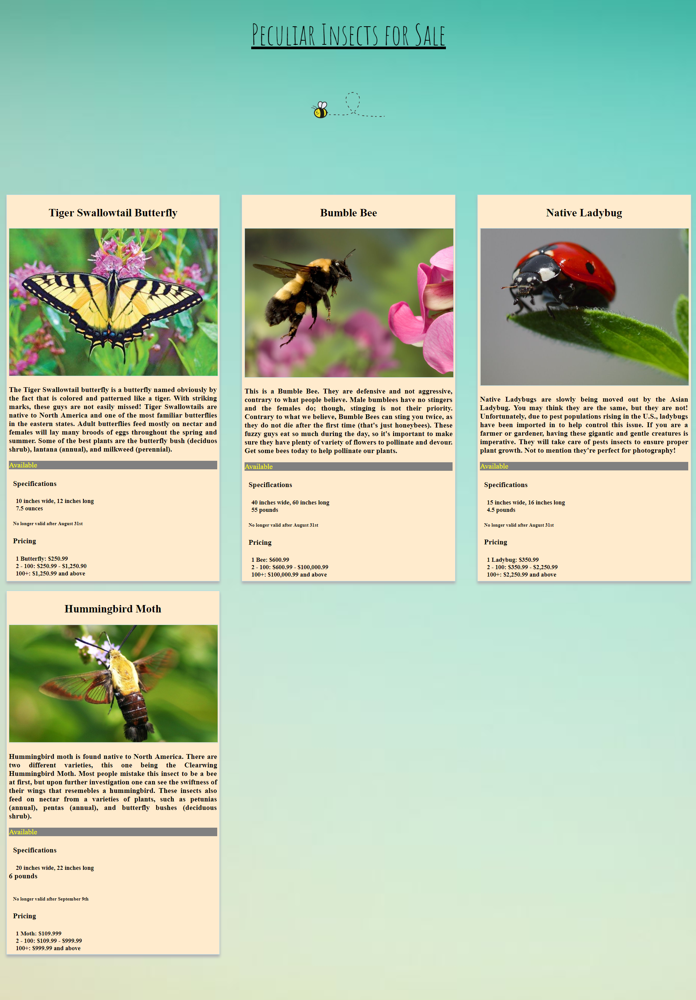

# First Group Project

This is a project that emmersed begginer students into CS and HTML. I built some simple cards that explored flex box, padding, margin, url's, etc. in css and writing the basic structure of HTML. 

# Screenshot 



# How to run this project

1. Use npm to install http-server in your terminal if you have not already:
```
npm install -g http-server
```

2. Run the server: 
```
hs -p 9999
```
3. Open Chrome and navigate to:
```
localhost:9999
```